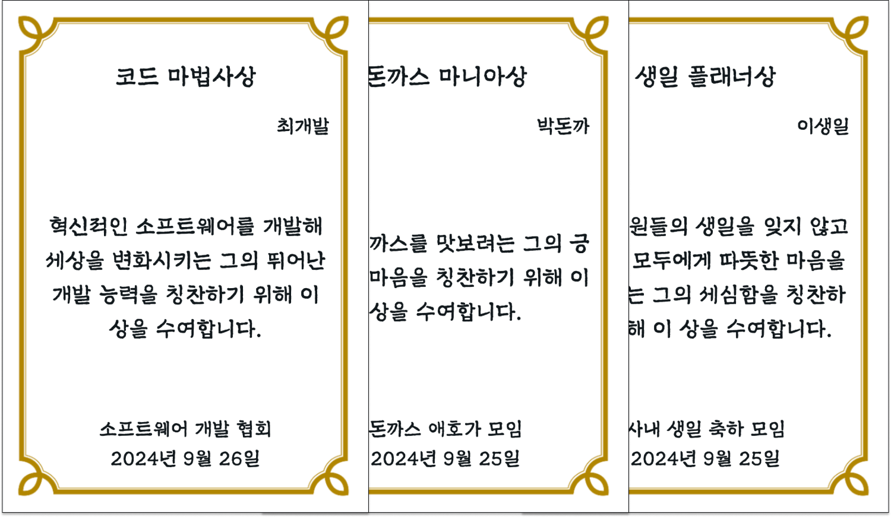

# award-factory


<p align="center">
  <br/>
  <strong>🎓 Showcasing Project, in 2024 Google Machine Learning Bootcamp 🎓</strong>
  <br/>
  <br/>
  <a href='https://github.com/ziweek/award-factory/blob/main/README_KO.md'>
    KOREAN
  </a>
  &nbsp;|&nbsp;
  <a href='https://github.com/ziweek/award-factory/blob/main/README.md'>
    ENGLISH
  </a>
  <br/>
  <br/>
  <strong>Award-Factory: Awards crafted for you by a hilariously talented generative AI</strong>
  <br/>
  <br/>
  <a href='https://paperswithcode.com/paper/gemma-open-models-based-on-gemini-research'>
    
  </a>
  <br/>
  
   
  
  <br/>
  
  
  
</p>
<br/>

<p align="center">  
  <strong>Check out prototypes in the badge below<strong>
  <br/>
  <br/>
  <a href='https://award-factory.vercel.app'>
    
  </a>
  <a href='https://huggingface.co/ziweek/gemma-2b-it-award-factory'>
      
  </a>
  <a href='https://huggingface.co/datasets/ziweek/award-factory-citation'>
      
  </a>
</p>

<br/>
<br/>

# 1. Introduction

> [!NOTE]
>
> - This project aims to develop a service where anyone can effortlessly create a customized certificate in just a few minutes, making it easy to celebrate and appreciate others.
> - Award Factory was conceived as a heartwarming project to spread happiness, inspired by the idea of creating special certificates for parents. Built with sustainability in mind, the service integrates front-end components and leverages the fine-tuned Google Gemma:2b model to deliver personalized award texts. While the service is not fully active due to server operation costs, a demo is available on Huggingface.
> - Advanced technologies like QLoRA quantization and llama-cpp optimizations were employed to reduce model size and improve performance, ensuring an efficient user experience in the future.

https://github.com/user-attachments/assets/2def17e0-46ea-4561-8b50-fc78d595b88b

<table>
    <tr>
    <td style="width:1/2;">
      <p align="center">App Design</p>
    </td>
    <td style="width:1/2;">
      <p align="center">Generated Awards</p>
    </td>
  </tr>
  <tr>
    <td style="width:1/2;">
      
    </td>
    <td style="width:1/2;">
      
    </td>
  </tr>
</table>
<br/>
<br/>

# Implementation

<table>
  <tr>
    <td style="width:1/2;">
      
    </td>
  </tr>
</table>

<details open>
 <summary><b>Google Gemma:2B Finetuning</b></summary>
Implemented prompt engineering and QLoRA-based quantization fine-tuning using the Google/Gemma-2b-it model with PEFT techniques to optimize personalized award text generation tailored to user preferences.
</details>
<br/>

<details open>
 <summary><b>llama-cpp Quantization</b></summary>
Applied quantization with the Q5_K_M option in llama-cpp, achieving a 63.3% reduction in model size and an 83.4% decrease in inference time without compromising performance, enabling faster and more efficient service.

<br/>

```
$ llama.cpp/llama-quantize gguf_model/gemma-2b-it-award-factory-v2.gguf gguf_model/gemma-2b-it-award-factory-v2.gguf-Q5_K_M.gguf Q5_K_M

...
llama_model_quantize_internal: model size  =  4780.29 MB
llama_model_quantize_internal: quant size  =  1748.67 MB

main: quantize time = 17999.81 ms
main:    total time = 17999.81 ms
```

```
$ ollama list

NAME                    ID              SIZE      MODIFIED
award-factory:q5        8df06172b64b    1.8 GB    19 seconds ago
award-factory:latest    ae186115cc83    5.0 GB    28 minutes ago
```

</details>
<br/>

<details open>
  <summary><b>Docker-compose</b></summary>
Utilized Docker Compose to containerize the backend and frontend services, ensuring consistency in deployment environments and facilitating scalable and maintainable full-stack web application development.
</details>
<br/>
<br/>

# Contribution

<a href="https://github.com/ziweek/award-factory/graphs/contributors">
  
</a>
