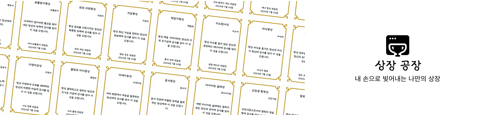
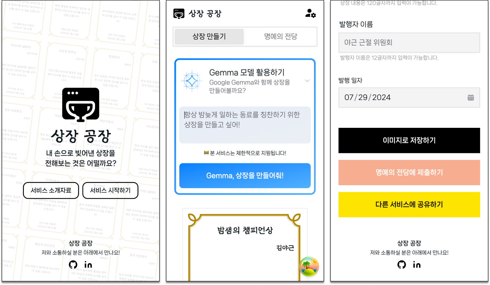

# award-factory



<p align="center">
  <br/>
  <strong>🎓 구글 머신러닝 부트캠프 출품 작품 🎓</strong>
  <br/>
  <br/>
  <a href='https://github.com/ziweek/award-factory/blob/main/README_KO.md'>
    KOREAN
  </a>
  &nbsp;|&nbsp;
  <a href='https://github.com/ziweek/award-factory/blob/main/README.md'>
    ENGLISH
  </a>
  <br/>
  <br/>
  <strong>상장 공장: 유쾌하게 재능 있는 생성형 AI가 당신을 위해 정성스럽게 만든 상장</strong>
  <br/>
  <br/>
  <a href='https://paperswithcode.com/paper/gemma-open-models-based-on-gemini-research'>
    
  </a>
  <br/>
  
   
  
  <br/>
  
  
  
</p>
<br/>

<p align="center">  
  <strong>아래의 뱃지에서 프로토타입을 확인해보세요.<strong>
  <br/>
  <br/>
  <a href='https://award-factory.vercel.app'>
    
  </a>
  <a href='https://huggingface.co/ziweek/gemma-2b-it-award-factory'>
      
  </a>
  <a href='https://huggingface.co/datasets/ziweek/award-factory-citation'>
      
  </a>
</p>

<br/>
<br/>

# 1. 개요

> [!NOTE]
>
> - 이 프로젝트는 누구나 간편하게 몇 분 안에 맞춤형 상장을 제작하여, 타인을 손쉽게 축하하고 격려할 수 있는 서비스를 개발하는 것을 목표로 합니다.
> - 상장 공장은 행복을 나누기 위해 기획된 프로젝트로, 부모님께 특별한 상장을 드리자는 아이디어에서 출발했습니다. 지속 가능성을 고려해 프론트엔드 중심으로 설계되었으며, Google Gemma:2b 모델을 파인튜닝하여 사용자 맞춤형 상장 문구를 제공하는 기능을 구현했습니다. 현재는 서버 운영 비용 문제로 서비스가 활성화되지 않았지만, 데모는 Huggingface에서 확인할 수 있습니다.
> - QLoRA 양자화 및 llama-cpp 최적화와 같은 최신 기술을 적용해 모델 크기를 줄이고 성능을 향상시켜, 향후 더 효율적인 사용자 경험을 제공할 수 있도록 준비했습니다.

https://github.com/user-attachments/assets/2def17e0-46ea-4561-8b50-fc78d595b88b

<table>
    <tr>
    <td style="width:1/2;">
      <p align="center">앱 디자인</p>
    </td>
    <td style="width:1/2;">
      <p align="center">생성된 상장</p>
    </td>
  </tr>
  <tr>
    <td style="width:1/2;">
      
    </td>
    <td style="width:1/2;">
      
    </td>
  </tr>
</table>
<br/>
<br/>

# Implementation

<table>
  <tr>
    <td style="width:1/2;">
      
    </td>
  </tr>
</table>

<details open>  
 <summary><b>Google Gemma:2B 파인튜닝</b></summary>  
Google/Gemma-2b-it 모델에 PEFT 기법을 활용하여 프롬프트 엔지니어링 및 QLoRA 기반 양자화 파인튜닝을 구현함으로써, 사용자 선호에 맞춘 맞춤형 상장 문구 생성을 최적화했습니다.  
</details>  
<br/>

<details open>  
 <summary><b>llama-cpp 양자화</b></summary>  
llama-cpp에서 Q5_K_M 옵션을 사용하여 양자화를 적용하고, 모델 크기를 63.3% 감소시키며 추론 시간을 83.4% 단축하여 성능 저하 없이 더 빠르고 효율적인 서비스를 가능하게 했습니다.

<br/>

```
$ llama.cpp/llama-quantize gguf_model/gemma-2b-it-award-factory-v2.gguf gguf_model/gemma-2b-it-award-factory-v2.gguf-Q5_K_M.gguf Q5_K_M

...
llama_model_quantize_internal: model size  =  4780.29 MB
llama_model_quantize_internal: quant size  =  1748.67 MB

main: quantize time = 17999.81 ms
main:    total time = 17999.81 ms
```

```
$ ollama list

NAME                    ID              SIZE      MODIFIED
award-factory:q5        8df06172b64b    1.8 GB    19 seconds ago
award-factory:latest    ae186115cc83    5.0 GB    28 minutes ago
```

</details>
<br/>

<details open>  
 <summary><b>Docker-compose</b></summary>  
Docker Compose를 활용해 백엔드와 프론트엔드 서비스를 컨테이너화하여 배포 환경의 일관성을 보장하고, 확장 가능하며 유지보수하기 쉬운 풀스택 웹 애플리케이션을 개발했습니다.  
</details>  
<br/>

# Contribution

<a href="https://github.com/ziweek/award-factory/graphs/contributors">
  
</a>
